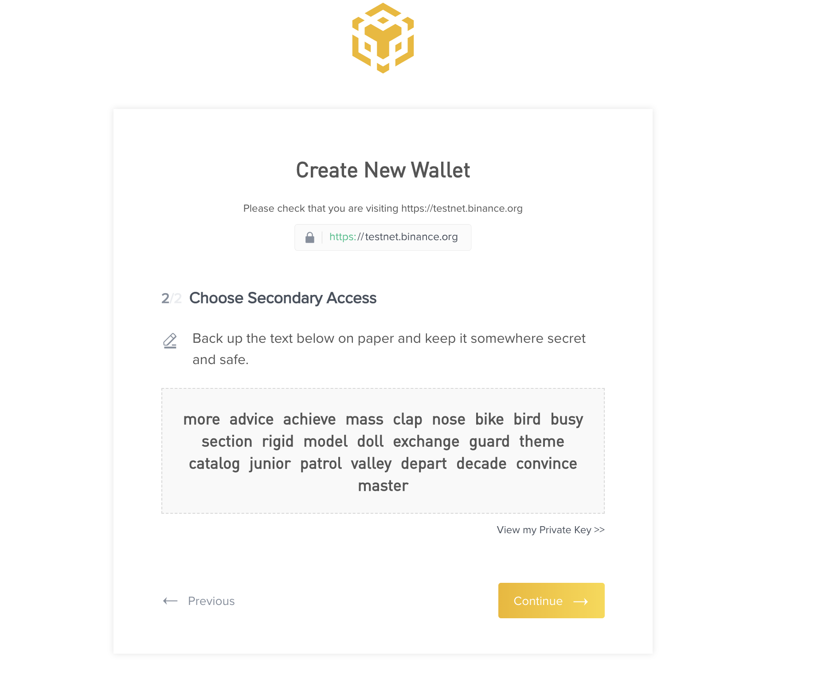
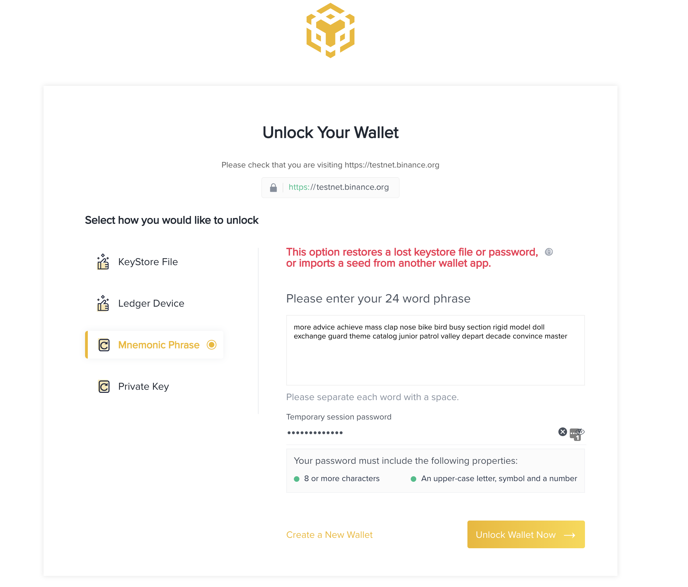

### Web Wallet

- You can create a key via [web wallet](https://testnet.binance.org/create)

Follow the instructions and set your password (password is used to unlock the keystore file that you will get here):

Then click `Download Keystore File` and you will get a keystore file and be directed to mnemonic page. Make sure to back up mnemonic here as it will be used to restore your key.

- You can restore your key [here](https://testnet.binance.org/unlock)

Choose `Mnenomic Phrase`, paste the mnemonic you get above and set your session password:

Your wallet will be unlocked and you can get your address here (for this example it is `tbnb14m2gcdjq7aqkdtu2m9qrqrl8eevzpqfj9xc0uu`):

To start, navigate to the Binance Chain <u>[homepage](https://www.binance.org/en)</u>(or<u>[testnet](https://testnet.binance.org/en/)</u> if you wish to test using testnet funds) and click on “Create Wallet” in the upper left-hand corner of your screen.

You will be prompted with a tutorial on how to create a wallet directly on the website. Read it carefully!

As a Binance Chain user, you will hold full custody of your funds. No one, not even Binance will be able to help you recover your wallet if you lose your private key, mnemonic phrase or keystore file.

Upon creating a wallet, the following will be generated for you. Please store them securely.

- **Keystore (encrypted & password protected)**

A keystore file contains your private key along with your public key and address (both of which are derived from your private key). This file is encrypted and password protected. This is the recommended way to access your wallet if you do not have access to a supported hardware device.

- **Mnemonic Phrase**

A mnemonic phrase is generated based on a BIP39 word list - this phrase allows you to access your wallet, but should not be used regularly. It is recommended you only use your mnemonic phrase as a backup.

- **Private Key**

This allows you to access your wallet, but should not be used regularly. It is recommended you only use your private key as a backup.

In order to create a keystore file, you will need to assign a password that will be used to access the file. When logging into the Binance DEX, this password will also function as your session password. Note that your password needs to have 8 or more characters; an upper-case letter, symbol and a number.

Once you have entered your password, click “Download Keystore File”.

In the next step, your mnemonic phrase will be generated. Make sure no one is able to see your screen during this phase.

Once you’ve proceeded to the next step, you will see your mnemonic phrase and you will be able to view your private key by clicking on “View my Private Key >>” after you have finished writing down your mnemonic phrase.

The recommended methods of accessing your wallet are with a keystore file or a supported hardware device.

Storage tips for the mnemonic phrase and private key:

Do not store on an electronic device (computer, phone, etc.).
Do not print them out. Printers have a memory of what they print.
Hand-write them on paper.
Do not put your private key or mnemonic phrase in your wallet.
Store them in a fireproof and waterproof safe/lockbox.

Congratulations. You’ve created a wallet on the Binance Chain. You may now use the wallet with the Binance DEX.

To keep your fund safe, please read this guide <u>[here](https://community.binance.org/topic/289/best-practice-to-safely-use-binance-dex)</u>.

- List of Wallets Supporting Binance Chain Mainnet
- [ ] https://docs.binance.org/get-started.html (copy wallets section)
- [ ] https://docs.binance.org/account.html (account)
- [ ] https://docs.binance.org/transfer.html (transfer)

::: warning Do your own research and take precautions in regards to wallet security. Neither Binance Chain dev team nor binance.com is liable if you lose your funds using these third party wallets. :::

These community-maintained web and mobile wallets allow you to store & transfer BNB, issue/manage asset, create on-chain governance proposals. Note that we do not endorse any of the wallets, they are listed for your convenience.

## For trading on Binance DEX

- [Trust Wallet](https://trustwallet.com)
- [Trubi Wallet](https://trubi.io)
- [Math Wallet](https://www.mathwallet.org/en)
- [MEET.ONE Wallet](https://meet.one)
- [Equal Wallet](https://equal.tech)
- [Magnum Wallet](https://magnumwallet.co)
- [Coinomi Wallet](http://coinomi.com)
- [ZelCore Wallet](https://zeltrez.io)
- [Infinito Wallet](https://zeltrez.io)
- [DDEX Wallet](https://ddex.io)
- [SafePal Wallet](https://www.safepal.io): Hardware Wallet

## For asset management

- [Ledger](https://www.ledger.com): Hardware Wallet
- [CoolWallet](https://coolwallet.io): Hardware Wallet
- [Atomic Wallet](https://atomicwallet.io)
- [Guarda Wallet](https://guarda.co)
- [Zengo Wallet](https://zengo.com)
- [HooWallet](https://hoo.com/)
- [Cobo Wallet](https://cobo.com/)
- [Exodus](https://www.exodus.io)
- [Midas Wallet](https://www.midasprotocol.io)
- [Arax Wallet](https://arax.io)
- [Pundi X Wallet](https://pundix.com)
- [Cosmostation Wallet](https://www.cosmostation.io)
- [Trezor](https://trezor.io/)
- [Mixin](https://mixin.one)
