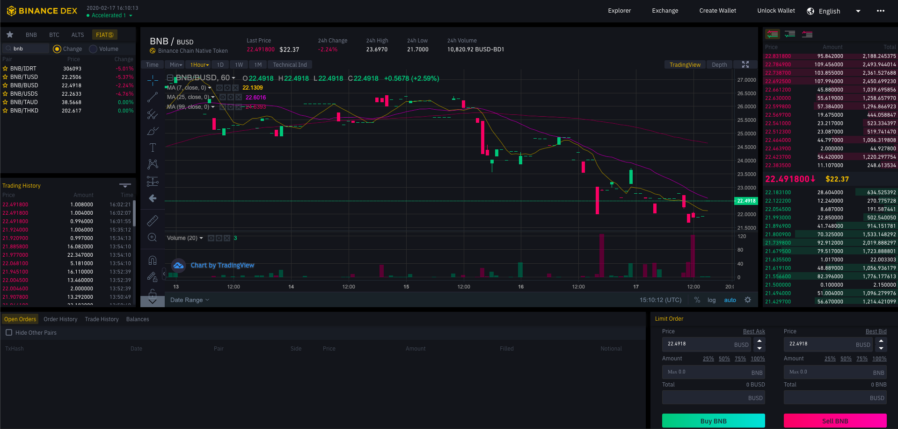

At the heart of Binance Chain is a DEX that features a highly performant matching engine. Matching happens within blockchain nodes and all transactions are recorded on-chain, forming a complete, auditable ledger of activity.

Binance DEX provides similar functionality as that of the centralized exchange, but with orders and order matching done over a set of distributed validator nodes. This technology is still in active development as we seek to progressively decentralize Binance.



## Markets and Trading Pairs

Our DEX consists of many `markets` for trading pairs of two digital assets (e.g. `BNB` and `BUSD-BD1`). You can see the markets available on Binance DEX through the following API.

<!--DOCUSAURUS_CODE_TABS-->
<!--Mainnet CLI-->

```shell
$ curl https://dex.binance.org/api/v1/markets
$ curl https://dex.binance.org/api/v1/markets | json_pp # formats JSON
```

<!--END_DOCUSAURUS_CODE_TABS-->

You will see an array of trading pairs in JSON format.

```json
[
    ...,
    {
        "base_asset_symbol": "BNB",
        "list_price": "17.50000000",
        "lot_size": "0.00100000",
        "quote_asset_symbol": "BUSD-BD1",
        "tick_size": "0.00010000"
    },
    ...,
]
```

| Key                | Description                                 |
| ------------------ | ------------------------------------------- |
| Base Asset Symbol  | e.g. BNB                                    |
| List Price         | The historical price at the time of listing |
| Lot Size           | The minimum order size and increment        |
| Quote Asset Symbol | e.g. BUSD-BD1                               |
| Tick Size          | The minimum unit of of price change         |

Note that in Binance Chain, tick size and lot size are not fixed, and will be subject to periodic review.

## View Order Book

For each trading pair, we can see the live order book by quering Binance DEX.

> Trading pairs are referred to in `Base Asset Symbol`\_`Quote Asset Symbol`, e.g. `BNB_BUSD-BD1`

<!--DOCUSAURUS_CODE_TABS-->
<!--Mainnet CLI-->

```shell
bnbcli dex show
  --symbol BNB_BUSD-BD1   # Format: BaseAsset_QuoteAsset
  --chain-id Binance-Chain-Tigris
  --node https://dataseed5.defibit.io:443
```

<!--END_DOCUSAURUS_CODE_TABS-->

This should return an order book in the following format. You can see the price and quantity of existing orders, as well as impute the spread.

```shell
         SellQty|       SellPrice|        BuyPrice|          BuyQty
     58.42600000|     23.12250000|     22.91820000|     29.38600000
     21.19600000|     23.15250000|     22.85740000|      9.03000000
     15.62000000|     23.18150000|     22.79410000|     27.32600000
     80.35700000|     23.21680000|     22.73090000|     15.27500000
     75.11200000|     23.25220000|     22.73020000|     36.25300000
     90.74200000|     23.29210000|     22.65850000|     52.57000000
     80.54400000|     23.33170000|     22.58850000|     25.25500000
    110.25400000|     23.37130000|     22.51920000|     27.47900000
    123.64700000|     23.40580000|     22.45000000|     51.33500000
      3.84300000|     23.43640000|     22.37890000|     39.37400000
    167.46400000|     23.44020000|     22.30780000|     89.04400000
```

## Place Order

Let's place an order to sell some BNB for BUSD in our `quickstart_key` wallet.

Pick the top bid in the buy orderbook. In this example, the current top bid in the buy orderbook is 22.91820000.

<!--DOCUSAURUS_CODE_TABS-->
<!--Mainnet CLI-->

```shell
bnbcli dex order
  --symbol BNB_BUSD-BD1
  --side 2
  --price 2291820000  # Shifted by 10^8
  --qty 100000        # Minimum lot size (0.00100000), shifted by 10^8
  --from quickstart_key
  --chain-id Binance-Chain-Tigris
  --node https://dataseed5.defibit.io:443
  --tif gte
```

<!--END_DOCUSAURUS_CODE_TABS-->

> **Note** Quantities here are expressed without decimals, i.e. shifted by 10^8

There are a few flags here that are critical:

- `--side` refers to whether you are buying or selling (the Base Asset, in this case `BNB`)
- `--qty` is the quantity, which needs to be larger than the minimum `lot_size`
- `--tif` is the time in force, which is either
  - `Good till Expiry` (GTE): orders stay on the exchange until they are filled by the opposite orders satisfying the limit price, or cancelled, or expire after 72 hours
  - `Immediate or Cancel` (IOC): only exist for that particular block, and are either filled or expired and removed from the order book right away

This should result in the output below:

```shell
Committed at block 68931155 (tx hash: 2EF8EF11440A405BDA7F7497EFAC5E57B9F0F8245BEEC36208366ACD5B9F2336, response: {Code:0 Data:[123 34 111 114 100 101 114 95 105 100 34 58 34 68 56 66 67 53 57 68 53 55 49 55 57 53 65 51 52 68 55 68 53 65 48 57 56 66 65 52 70 49 67 50 54 67 48 55 69 55 56 68 51 45 52 34 125] Log:Msg 0:  Info: GasWanted:0 GasUsed:0 Events:[{Type: Attributes:[{Key:[97 99 116 105 111 110] Value:[111 114 100 101 114 78 101 119] XXX_NoUnkeyedLiteral:{} XXX_unrecognized:[] XXX_sizecache:0}] XXX_NoUnkeyedLiteral:{} XXX_unrecognized:[] XXX_sizecache:0}] Codespace: XXX_NoUnkeyedLiteral:{} XXX_unrecognized:[] XXX_sizecache:0})
Msg [NewOrderMsg{Sender: D8BC59D571795A34D7D5A098BA4F1C26C07E78D3, Id: D8BC59D571795A34D7D5A098BA4F1C26C07E78D3-4, Symbol: BNB_BUSD-BD1}] was sent.
```

This return output has a few important details:

- `Block Number` where the order was included
- `Tx Hash` which is the
- `NewOrderMsg`, which includes
  - `Id` : the order ID, which is needed to cancel the order (i.e. `D8BC59D571795A34D7D5A098BA4F1C26C07E78D3-5`)

Once the order fills, query the account balance to see if the `BUSD` has been purchased.

```bash
$ bnbcli account bnb1mz79n4t309drf4745zvt5ncuymq8u7xnj7ptxz
  --chain-id Binance-Chain-Tigris
  --node https://dataseed5.defibit.io:443
  --indent
{
  "type": "bnbchain/Account",
  "value": {
    "base": {
      "address": "bnb1mz79n4t309drf4745zvt5ncuymq8u7xnj7ptxz",
      "coins": [
        {
          "denom": "BNB",
          "amount": "9687457"
        },
        {
          "denom": "BUSD-BD1",
          "amount": "2305160"
        }
      ],
      "public_key": {
        "type": "tendermint/PubKeySecp256k1",
        "value": "Al2ietMFL8LTEsw6T20n3XA7CH601nn7vqOQCDapbr5T"
      },
      "account_number": "366218",
      "sequence": "5"
    },
    "name": "",
    "frozen": null,
    "locked": [
      {
        "denom": "BNB",
        "amount": "100000"
      }
    ],
    "flags": "0"
  }
}
```

## Cancel Order

To cancel an order, you will need to use the `Order ID` that was returned when placing the order.

To demonstrate this, let's create an order to be cancelled, that is far from the clearing price.

<!--DOCUSAURUS_CODE_TABS-->
<!--Mainnet CLI-->

```shell
./bnbcli dex order
  --symbol BNB_BUSD-BD1
  --side 2
  --price 10100000000   # i.e. $101 per BNB
  --qty 100000
  --from quickstart_key
  --chain-id Binance-Chain-Tigris
  --node https://dataseed5.defibit.io:443
  --tif gte
```

<!--END_DOCUSAURUS_CODE_TABS-->

The following response is returned. We can see from the response that the the `Order ID` is `D8BC59D571795A34D7D5A098BA4F1C26C07E78D3-7`

```shell
Committed at block 68942404 (tx hash: 14B5CCEDF7C307DA4E062C35E4E553506B32B2C4E0C0C8524DF5BD9CA2E45470, response: {Code:0 Data:[123 34 111 114 100 101 114 95 105 100 34 58 34 68 56 66 67 53 57 68 53 55 49 55 57 53 65 51 52 68 55 68 53 65 48 57 56 66 65 52 70 49 67 50 54 67 48 55 69 55 56 68 51 45 55 34 125] Log:Msg 0:  Info: GasWanted:0 GasUsed:0 Events:[{Type: Attributes:[{Key:[97 99 116 105 111 110] Value:[111 114 100 101 114 78 101 119] XXX_NoUnkeyedLiteral:{} XXX_unrecognized:[] XXX_sizecache:0}] XXX_NoUnkeyedLiteral:{} XXX_unrecognized:[] XXX_sizecache:0}] Codespace: XXX_NoUnkeyedLiteral:{} XXX_unrecognized:[] XXX_sizecache:0})
Msg [NewOrderMsg{Sender: D8BC59D571795A34D7D5A098BA4F1C26C07E78D3, Id: D8BC59D571795A34D7D5A098BA4F1C26C07E78D3-7, Symbol: BNB_BUSD-BD1}] was sent.
```

This results in the following order book:

```shell
$ bnbcli dex show -l BNB_BUSD-BD1 --chain-id Binance-Chain-Tigris --node https://dataseed5.defibit.io:443

         SellQty|       SellPrice|        BuyPrice|          BuyQty
      0.50000000|     23.12500000|     22.91820000|     29.38600000
      ...
      ...
      ...
      9.00000000|    100.00000000|     20.02120000|      5.28900000
      0.00100000|    101.00000000|     20.01210000|      2.67900000   # <- Our order
```

To cancel the order, we use the following command:

<!--DOCUSAURUS_CODE_TABS-->
<!--Mainnet CLI-->

```shell
$ bnbcli dex cancel
  --symbol BNB_BUSD-BD1
  --chain-id Binance-Chain-Tigris
  --node https://dataseed5.defibit.io:443
  --refid D8BC59D571795A34D7D5A098BA4F1C26C07E78D3-7
  --from quickstart_key
```

<!--END_DOCUSAURUS_CODE_TABS-->

This results in the following response, indicating a `CancelOrderMsg`.

```shell
Committed at block 68943581 (tx hash: BDE20CE5E48DF0CD6E831A7C94F8024A075005FB705F5AC3DD2EE6BC7A59CB77, response: {Code:0 Data:[] Log:Msg 0:  Info: GasWanted:0 GasUsed:0 Events:[{Type: Attributes:[{Key:[97 99 116 105 111 110] Value:[111 114 100 101 114 67 97 110 99 101 108] XXX_NoUnkeyedLiteral:{} XXX_unrecognized:[] XXX_sizecache:0}] XXX_NoUnkeyedLiteral:{} XXX_unrecognized:[] XXX_sizecache:0}] Codespace: XXX_NoUnkeyedLiteral:{} XXX_unrecognized:[] XXX_sizecache:0})
Msg [CancelOrderMsg{Sender:D8BC59D571795A34D7D5A098BA4F1C26C07E78D3, RefId: D8BC59D571795A34D7D5A098BA4F1C26C07E78D3-7}] was sent.
```

The order book should no longer have your order listed any more.

```shell
$ bnbcli dex show -l BNB_BUSD-BD1 --chain-id Binance-Chain-Tigris --node https://dataseed5.defibit.io:443

         SellQty|       SellPrice|        BuyPrice|          BuyQty
      0.50000000|     23.12500000|     22.91820000|     29.38600000
      ...
      ...
      ...
      9.00000000|    100.00000000|     20.02120000|      5.28900000
      0.00000000|      0.00000000|     20.01210000|      2.67900000
```
